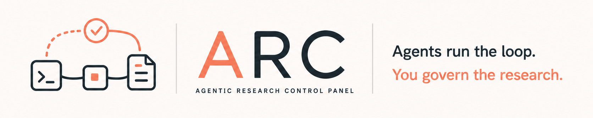
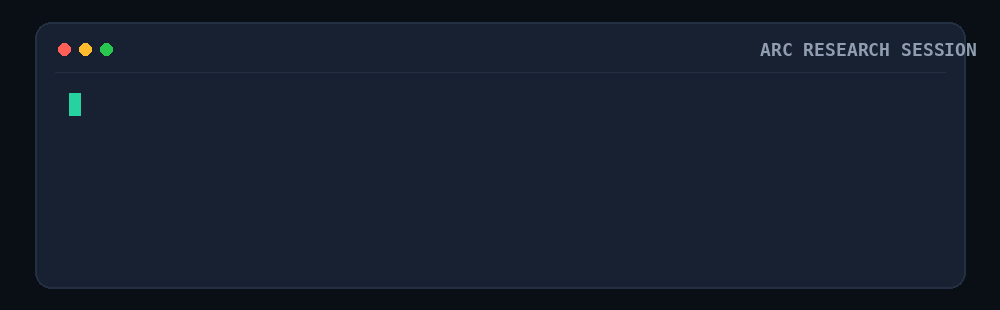
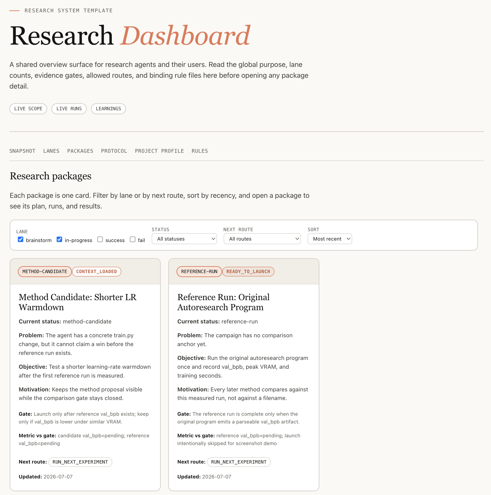
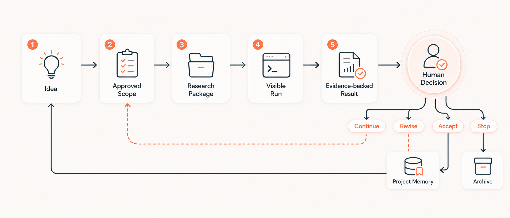

<div align="center">



# Agentic Research Control Panel (ARC)

**Agents run the loop. You govern the research.**

A local control layer for coding agents that run research experiments in real repos,<br />
with approved objectives, visible runs, evidence-backed results, and project memory you can inspect.

[Why ARC?](#why-arc) ·
[Storage Model](#one-managed-root) ·
[Quick Start](#quick-start) ·
[Research Loop](#the-research-loop) ·
[Command Reference](#command-reference)

<br />



</div>

<p align="center">
  
</p>

<p align="center">
  <sub>A human control surface for project scope, package status, live runs, evidence, results, and decisions.</sub>
</p>

---

## Why ARC?

When a coding agent runs experiment after experiment in a real research repo,
successful execution is only the first requirement. The harder question is
whether the research state still belongs to the project instead of the chat.

| Challenge | Question ARC keeps visible |
| --- | --- |
| 🎯 **Objective drift** | Can you see whether the agent is still bound to the objective, metric, and baseline you approved? |
| 👀 **Run visibility** | Can you inspect an active campaign instead of trusting a later summary? |
| 📎 **Evidence traceability** | Can you trace a reported metric to the command, context, log, and result that produced it? |
| 🧠 **Project memory** | Can the next session reuse what prior work proved or ruled out? |

ARC keeps management state and experimental evidence outside chat memory. The
agent works through typed queries and guarded commands. The human sees the same
research through a browser interface and ratifies changes that alter intent or
terminal conclusions.

## One Managed Root

ARC manages one versioned root per research workspace:

```text
.research/
|-- VERSION
|-- state/
|   |-- events.jsonl
|   |-- current.json
|   |-- migration.json                 # present after an explicit migration
|   `-- notes/<sha256>.md
|-- audit/
|   `-- actions.jsonl
|-- experiments/
|   `-- <package>/<experiment>/<run>/
|       |-- run.json
|       |-- context.json
|       |-- status.json
|       |-- events.jsonl
|       |-- metrics.jsonl
|       |-- log.txt
|       |-- result.json
|       `-- files/, checkpoints, and experiment-specific files
`-- interface/
    |-- index.html
    |-- live.html
    |-- scope.html
    |-- learnings.html
    |-- packages/<package>/
    |   |-- index.html
    |   |-- plan.html
    |   |-- tracker.html
    |   |-- results.html
    |   |-- implementation.html
    |   |-- analysis.html
    |   `-- docs/
    `-- data/
```

The four directories exist because they answer different questions:

| Layer | Owns | Mutability |
| --- | --- | --- |
| `state/` | Ratified intent, package and experiment records, decisions, rules, learnings, and management history | Guarded event writes |
| `audit/` | The outcome of attempted management commands, including rejections | Append-only |
| `experiments/` | What actually ran and the evidence it produced | Run-local, then immutable evidence |
| `interface/` | What a person needs to inspect | Rebuildable projection |

`state/events.jsonl` is the management authority. Run directories are the
execution and evidence authority. `state/current.json` is a rebuildable state
projection. Everything under `interface/` is a human read model.

This storage change does not redesign the browser experience. The existing
dashboard navigation, package pages, modules, tables, and visual layout remain
multi-page and keep their current structure. Only their source and generated
location move under `.research/interface/`.

Agents do not use `interface/` as context, evidence, or authority. They query
state through the bounded command surface and inspect the relevant run files.
If the interface disagrees with state or run evidence, rebuild the interface
from those authorities.

### The only path setting

The default root is `<workspace>/.research`. Set `RESEARCH_ROOT` only when the
managed tree must live elsewhere:

```bash
export RESEARCH_ROOT=/data/my-project/.research
```

Every state, audit, experiment, migration, query, and interface command resolves
the same root. There is no second runtime-data root.
Process-local server metadata is not persisted research data.

## The Research Model

The intent hierarchy is:

```text
Project -> Direction -> Experiment
                         |
                         `-> Run 1, Run 2, ...
```

- **Project** defines the ratified objective and non-negotiable constraints.
- **Direction** defines one approved research strategy under that objective.
- **Experiment** is the only executable specification. Its `spec` owns the
  purpose, configuration reference, gate, and control mode.
- **Package** groups the working records and experiments for a bounded piece of
  research. It is not another Scope level.
- **Run** is one execution attempt against one Experiment.

There is no separate Task entity. Work previously represented as a Task is
represented by `Experiment.spec`, so intent and execution cannot drift across
two competing objects.

## Quick Start

Give the agent two things: the target workspace and whether the setup is for
Codex, Claude Code, or both. `research-init` inspects first, preserves existing
project instructions, initializes or migrates the managed root, installs the
skills, builds the interface, and starts the Dashboard Server by default.

### 1. Bootstrap `research-init` once

The setup skill must be discoverable before it can install its siblings. Link
only this skill from the toolbox checkout, then open a new agent session:

| Agent | Bootstrap destination | Invocation |
| --- | --- | --- |
| Claude Code | `$HOME/.claude/skills/research-init` | `/research-init` |
| Codex | `$HOME/.agents/skills/research-init` | `$research-init` |

```bash
PIPELINE=/path/to/Agentic-Research-Control-Panel
mkdir -p "$HOME/.agents/skills"
ln -s "$PIPELINE/skills/research-init" "$HOME/.agents/skills/research-init"
```

Use `$HOME/.claude/skills` instead for Claude Code. If the destination already
contains a real file or directory, stop and review it; setup does not replace
user-owned skill content.

### 2. Ask the agent to set up the workspace

For Codex:

```text
Use $research-init to set up /path/to/my-research-project for Codex.
```

For Claude Code:

```text
Use /research-init to set up /path/to/my-research-project for Claude Code.
```

The agent first reports whether the workspace is `ABSENT`, `LEGACY`,
`MIGRATION_STAGED`, `CURRENT`, or `INVALID`. Normal greenfield setup then runs:

```bash
python3 "$HOME/.agents/skills/research-init/scripts/research_init.py" \
  --workspace /path/to/my-research-project \
  setup --agent codex
```

By default this command starts a new Dashboard Server or reuses the healthy
server already attached to the same workspace. The result explicitly reports
`started` or `reused`, health, URL, host, port, and an SSH forwarding command.
It also reports the exact `stop` command. Use `--no-serve` only for an
explicitly requested headless or CI setup.

### 3. Resolve only the gates that apply

- Existing unmarked `AGENTS.md` or `CLAUDE.md`: inspect the proposed managed
  block, approve the merge, then rerun with `--merge-protocols`. Existing text
  stays intact.
- Legacy `research_html/` or `outputs/`: inspect the inventory, make a
  recoverable backup, then run `migrate --backup-confirmed`. Migration never
  deletes the legacy roots.
- External `RESEARCH_ROOT`: confirm the resolved path, then use
  `--allow-external-research-root`.
- `INVALID`: stop and repair the unknown version or unversioned root conflict;
  setup does not guess.

### 4. Read the completion report

Successful setup ends in one of two states:

- `READY_NO_PROJECT`: setup is healthy; continue with `research-onboard`.
- `READY_WITH_PROJECT`: setup is healthy; continue with `research-brainstorm`
  for a vague direction or `research-scope` for clear intent.

`REPAIR_REQUIRED` means at least one state, protocol, skill, interface, or
Server check failed. The setup report names the failed invariant. Do not
hand-edit `.research/interface/`; it is an atomic projection of managed state.

## The Research Loop

Each cycle moves through ratified intent, an executable Experiment, a visible
Run, evidence-backed results, a human decision, and reusable project knowledge.



| Stage | Claude Code | Codex |
| --- | --- | --- |
| Shape a rough idea | `/research-brainstorm` | `$research-brainstorm` |
| Ratify Project, Direction, or Experiment intent | `/research-scope` | `$research-scope` |
| Materialize a bounded package | `/research-package` | `$research-package` |
| Execute and verify an Experiment | `/research-run` | `$research-run` |
| Continue within one approved Direction | `/research-auto` | `$research-auto` |

### 1. Shape and ratify intent

Brainstorming may draft alternatives, but it does not change Scope. Project,
Direction, Experiment, and scope revisions enter Triage first. The agent may
propose them; only explicit human ratification commits them.

Use onboarding when a workspace has no ratified Project objective:

```text
/research-onboard
```

Onboarding proposes the objective and stops for acceptance, rejection, or
revision. It does not start a campaign.

### 2. Materialize a package

After a Direction and its Experiment specs are ratified:

```text
/research-package from-scope <direction-id>
```

The package groups the plan, experiment records, evidence slots, results, and
decisions. Materialization reads committed state only.

### 3. Query bounded context

An agent asks for the smallest state slice required by one package:

```bash
cd "$PIPELINE"
python3 skills/research-op/scripts/research_op.py \
  context <package-id> --workspace "$WORKSPACE"
```

Add `--phase <phase-id>` to narrow the selection further. The response is an
ephemeral query result. It is not written back as a package file and must not
become a second source of truth.

Useful management queries are:

```bash
python3 -m lib.research_state.cli --workspace "$WORKSPACE" \
  show experiment <experiment-id>
python3 -m lib.research_state.cli --workspace "$WORKSPACE" \
  history experiment/<experiment-id>
python3 -m lib.research_state.cli --workspace "$WORKSPACE" \
  audit <command-id>
```

### 4. Launch and inspect a Run

`research-run` owns readiness checks, the launch acknowledgement, monitoring,
result verification, and terminal routing. The underlying launcher is:

```bash
cd "$PIPELINE"
python3 -m lib.experiments.launch \
  --workspace "$WORKSPACE" \
  --package <package-id> \
  --experiment <experiment-id> \
  --cwd "$WORKSPACE" \
  -- python3 train.py
```

At authorization time, the launcher queries current state and writes an
immutable `context.json` beside `run.json`. That frozen context records exactly
what the Run was allowed to use. Later state changes do not rewrite it.

Inspect open runs or one run directory without reading the human interface:

```bash
python3 -m lib.experiments.report --workspace "$WORKSPACE" --open
python3 -m lib.experiments.report \
  --workspace "$WORKSPACE" \
  --run "$RESEARCH_ROOT/experiments/<package>/<experiment>/<run>"
```

If `RESEARCH_ROOT` is unset, replace it in the second command with
`$WORKSPACE/.research`.

### 5. Verify, decide, and learn

A metric becomes a research fact only when its protocol and evidence pass the
declared gate. Terminal adoption, archival, scope changes, and direction changes
remain human decisions. Accepted results and failed methods are written into
typed state so the next context query can retrieve them.

## Human Interface Contract

The interface is intentionally for people:

- It preserves the current dashboard, package-page, module, table, and visual
  layout.
- It is rebuilt from state and run evidence, never edited as authority.
- It may be deleted and regenerated without losing research truth.
- Agents may report its URL, but they do not read it to form context, infer
  status, verify a claim, or choose the next action.
- A stale page is a projection problem, not a reason to mutate HTML.

This boundary keeps the browser optimized for human comprehension while the
agent consumes compact, typed data.

## Human Control Points

- You approve the Project objective before research execution starts.
- You ratify Direction and Experiment intent before it becomes active.
- You can inspect active and recent Runs in the browser.
- You can trace results to frozen context, commands, logs, metrics, and files.
- You decide whether a terminal result is adopted, revised, archived, or
  continued.

ARC can sit beside MLflow, Weights and Biases, DVC, or another experiment
tracker. Those tools may own specialized telemetry or artifacts. ARC owns the
governed connection among intent, execution, evidence, decisions, and project
knowledge.

## Command Reference

| Capability | Primary skill | Durable result |
| --- | --- | --- |
| Set up, attach, migrate, or repair ARC | `research-init` | Verified setup plus a running Dashboard Server |
| Rebuild or inspect the human view | `research-dashboard` | `.research/interface/` |
| Establish the first Project objective | `research-onboard` | Proposal, then ratified Project state |
| Explore an uncommitted idea | `research-brainstorm` | Brainstorm record and optional Direction proposal |
| Change approved intent | `research-scope` | Ratified Project, Direction, or Experiment event |
| Create a bounded work unit | `research-package` | Package and Experiment records |
| Execute and verify | `research-run` | Run envelope, evidence, result, and routing decision |
| Run a direction-level campaign | `research-auto` | Campaign state and package cycles |
| Record analysis and rules | `research-analysis` | Typed learning and rule records |
| Apply guarded mutations and queries | `research-op` | State event plus audited outcome |
| Track long experiments | `research-exp-live` | Structured Run status and evidence |
| Register and allocate compute | `research-resource` | Resource and allocation records |

## Status

The versioned EventStore, Triage and ratification gates, package workflow,
immutable Run envelope, result verification, governed learning store, migration
path, and generated multi-page interface are implemented in this toolbox.

## Acknowledgements

The design was informed by prior work on auto-research agents, research skill
systems, and agent workflow methodology. This repo does not vendor those
projects. Its contribution is a governed control layer around agent-assisted
research: approved intent, visible runs, evidence-backed results, human
decisions, and reusable project knowledge.
