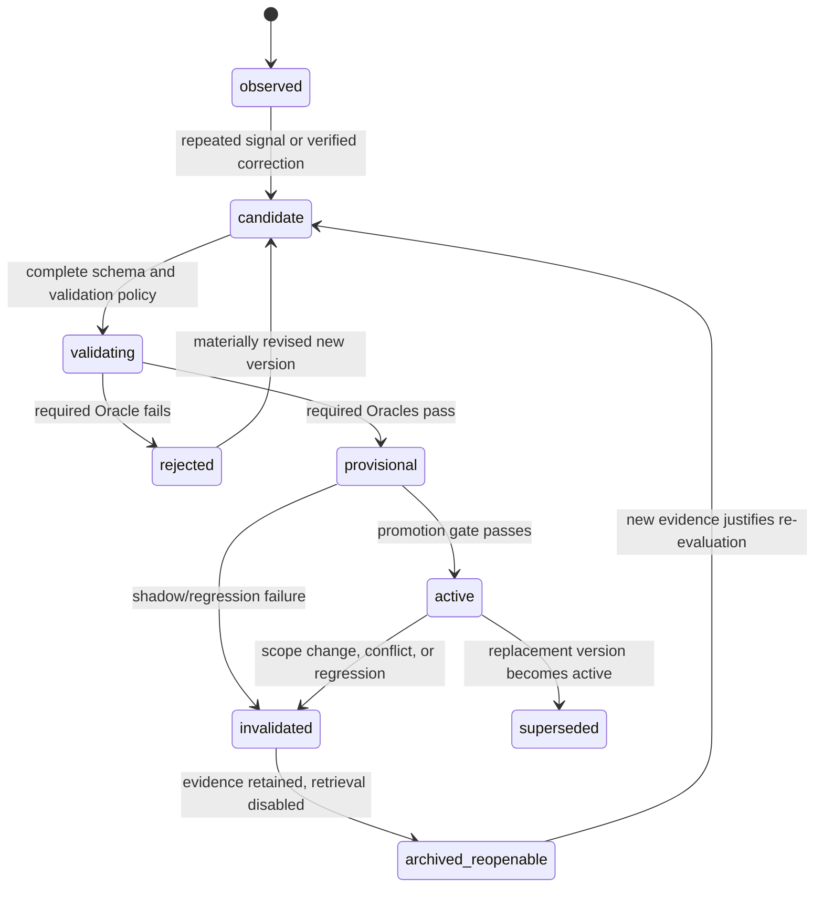
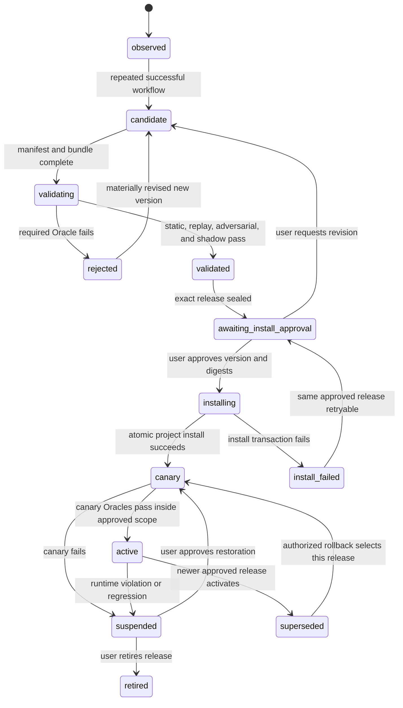

# Self-evolving agents → replacing the pipeline's simple self-learning — research & design plan

**Date:** 2026-06-04 (finalized 2026-06-05) · **Status:** ALL PHASES IMPLEMENTED (0–5, TDD, 2026-06-05) — full suite green. v1 Rule Store (Phases 0–1) + Tier-2 executable-Skill Store (Phases 2–5: gen/sandbox, approved deployment, worker+dashboard, pilot+go/no-go) all built. Concrete build plan in **§17**; build outcome in **§18**.

> **§18 — build outcome (2026-06-05).** Shipped TDD-first on conda `python3.13`. Full suite **400 passed** (292 baseline → **+108**, additive, 0 regressions).
>
> **v1 (Phases 0–1, Rule Store):** `lib/self_evolve/{schema,lifecycle,store,oracles,induce}.py` + `ops/evolution.py` (6 `evolution-*` ops) wired into `research_op.py` with the `--pkg _selfevolve` pre-`_read_inventory` exemption. Context Pack: `load_rule_store_active` + `export_learned_rules` (derived `_learned/rules.md`, proven-before-advisory). DoD green: single mutation surface; derived-only rules.md; R3/R4 parked; failing repro/regression blocks activation; deterministic fold + optimistic concurrency; scope-change invalidation; tiered admission (proven-effective vs advisory-admitted, §11.2).
>
> **Tier 2 (Phases 2–5, executable Skills):**
> - **P2** `skill_lifecycle.py` (§7.2 state machine), `sandbox.py` (deny-by-default boundary), `bundle.py` (content-addressed digests), `skill_oracles.py` (static/bundle/replay/adversarial/shadow/independent-review), `schema.validate_skill_manifest`/`validate_approval`; `evolution-create` now seals Skill candidates; sandbox/bundle gates reject at seal time.
> - **P3** `install.py` (exact-digest approval match, atomic `.claude/skills/.versions/` install + symlink swap, canary-scope gate, suspend, rollback authorization) + ops `evolution-approve` (Worker-cannot-approve trust gate), `evolution-install-skill`, `evolution-suspend-skill`, `evolution-rollback-skill`; release sealed at `validated`.
> - **P4** `worker.py` (trigger→job map, idempotent job dedup, budget reserve/exhaustion-pause, retry classification) + `dashboard.py` (deterministic `self-evolution.{json,js}` projection + fail-closed consistency oracles); `evolution-project`/`-check` now cover both stores.
> - **P5** `pilot.py` (3 bounded skill-unit specs + go/no-go from measured metrics; trust-boundary violation = hard no-go; `should_expand` gates Tier-2 expansion).
>
> **Not committed** (awaiting user). The Phase-5 go/no-go is built but un-exercised on real DL projects — expansion of Skill induction beyond the 3 pilot units still requires a `go` verdict from real pilot data.
**Method:** deep-research workflow — 5 search angles, 23 sources fetched, 113 claims extracted, 25 adversarially verified (3-vote, 25/25 confirmed, 0 killed).
**Goal:** find the optimal self-evolving strategy to replace the current simple rule-based self-learning in `Trustworthy-Research-Pipeline`, serving two objectives:
1. **Generality + skill induction** — work across heterogeneous DL research projects; learn the user's common workflows and distill them into project-level skills / default HTML dashboard scaffolds.
2. **Error-memory / anti-regression** — maintain a rules/lessons file that stops the agent repeating previously-hit bugs (capture, retrieval, ranking, decay/pruning, conflict resolution, context injection).

This connects to `[[multi-agent-ranking-jury-design]]` and `[[wiki-context-pack-integration]]` — the Context Pack is the memory substrate Layer B below can plug into.

---

## 1. Field taxonomy (how "self-evolving" decomposes)

Primary survey: **arXiv:2507.21046** *"A Survey of Self-Evolving Agents: What, When, How, and Where to Evolve."* Its structural insight reframes our two objectives.

**WHAT evolves** — four components:
- **Model** — parameters (SFT / RL fine-tuning)
- **Context** — splits into **Memory Evolution** *and* **Prompt Optimization** (survey: nearly interchangeable, both = "what's in the context window")
- **Tools** — skill / tool acquisition
- **Architecture** — single ↔ multi-agent topology

**WHEN** (train-time vs test-time; SFT/RL/in-context) · **HOW** (textual vs scalar feedback) · **WHERE** (4th dim, Jan 2026 revision).

Complementary survey **arXiv:2404.14387** (Alibaba) gives the **process loop** we'd actually implement: *acquire → refine → update → evaluate*.

**Litmus test for "real" evolution** (so we don't fool ourselves): updates must be (i) experience-dependent, (ii) persistent & policy-changing, (iii) self-initiated. Our current rule file already passes — the question is doing it *well*.

> **Key structural takeaway:** the two objectives are **not one mechanism**. Objective 1 lives in **Tools + Context-procedures**; Objective 2 lives in **Context-memory**. They want **two complementary memory layers**.

## 2. Category map (named systems + fit verdict)

| Category | Named systems | Fit |
| --- | --- | --- |
| Fine-tuning / RL evolution | Agentic-RL survey (2509.02547) | ❌ needs weight access + heavy infra; conflicts with frozen-API-model + minimal complexity. Completeness only. |
| **Workflow / procedure induction** | **AWM** (2409.07429) | ✅✅ best fit for Objective 1 |
| Code skill library | **Voyager** (2305.16291) | ✅ validates compositional reuse; adds execution-sandbox complexity |
| Meta-design / archive | **ADAS** (2408.08435) | ◐ powerful, heavyweight (meta-agent programs new agents) |
| Experiential rule extraction | **ExpeL** (2308.10144) | ✅ validates no-fine-tuning rules+trajectories architecture for API models |
| **Reasoning / error memory** | **ReasoningBank** (2509.25140 + Google blog) | ✅✅ best fit for Objective 2 |
| **Tuning-free rule accumulation + validation gate** | **TRAN** (2310.15746, EMNLP'23) | ✅✅ the quality gate for Objective 2 |

## 3. Objective 1 — generality + skill induction

**Core: Agent Workflow Memory (AWM, arXiv:2409.07429).** Induces commonly-reused routines ("workflows") from experience and selectively injects relevant ones into context — **memory-of-procedures, not memory-of-facts**. Exactly "learn the user's common workflow and distill into reusable skills/scaffolds."

Why it fits heterogeneous projects:
- Works **offline** (induce from curated demos) *and* **online** (induce from queries on the fly, no labeled data) — applies before we've curated demos.
- **Generalizes across tasks/sites/domains, advantage *widens* as the train-test gap grows** (8.9 → 14.0 absolute pts) — the property needed across dissimilar DL projects.
- Large relative gains (24.6% / 51.1% rel. SR on Mind2Web / WebArena) while *reducing steps*.

**Augment (patterns, not full imports):** Voyager — skills as executable/compositional/retrievable **code** (a "skill" here = a reusable dashboard scaffold, an experiment-loop procedure, a `research-op` recipe); ADAS — ever-growing **archive** of discovered procedures. AWM stays the lean core; Voyager/ADAS add sandbox/meta-agent complexity we adopt only if needed.

> ⚠️ All generality evidence (AWM/Voyager/ADAS) was measured on web-agents / Minecraft / QA-coding — **none on DL research-engineering**. Transfer is an extrapolation. The right **unit of a "skill"** for our domain (dashboard scaffold? experiment loop? debug routine?) is an open design question.

## 4. Objective 2 — error-memory / anti-regression (load-bearing)

**Core: ReasoningBank + TRAN hybrid.**

**ReasoningBank (arXiv:2509.25140 + research.google blog)** is purpose-built and **explicitly critiques AWM** for over-emphasizing successes and missing failure lessons — confirming we cannot reuse the Objective-1 mechanism for Objective 2. Blueprint:
- **Storage structure** — strategy-level items, 3 fields: **title** (concise identifier), **description** (summary), **content** (distilled reasoning / decision rationale / operational insight). **Not raw action logs.** E.g. *"always verify the current page identifier first to avoid infinite-scroll traps"* — a transferable guardrail.
- **Lifecycle (closed loop)** — retrieve & inject relevant memories **before acting** → after acting, **LLM-as-judge** evaluates trajectory → distill insights → append. Robust to judge noise (holds at ~70% judge accuracy).
- Distills from **both successes AND failures** — failures become preventative lessons. The literal answer to "don't repeat previous errors."

**TRAN (arXiv:2310.15746, EMNLP'23)** supplies the missing **quality / admission gate**, aligned with our TDD mandate:
- Tuning-free natural-language **if-then rules** from the model's *own* incorrect cases.
- Rules stay **independent of the primary prompt** → compose with existing prompt design, don't pollute it (matches context-isolation).
- **Test-driven admission:** on error, generate candidate rules → **retest the original input** → keep *only* rules that actually fix it ("effective rules"); discard the rest. The anti-bloat gate.

Maps onto the question's sub-asks: **capture** = LLM-judge distill + retest gate · **retrieval** = before-action injection by similarity · **injection** = context, independent of primary prompt · **ranking** = retrieval relevance + effective-rule status.

**ExpeL (arXiv:2308.10144)** underwrites the architecture: agent improving with *no weight access*, recalling both extracted insights (rules) and past trajectories — proven for proprietary API models, matching our model-tiering.

## 5. Recommended strategy — two-layer tuning-free memory stack

Replace "simple rule-based self-learning" with:

```
Layer A — Skill / Workflow Library (Objective 1)        [AWM core + Voyager/ADAS patterns]
  • Induce reusable procedures from user demonstrations across projects
  • Unit = project-level skill / dashboard scaffold / experiment-loop recipe
  • Offline (curated demos) + online (on-the-fly) induction

Layer B — Anti-Regression Rule Memory (Objective 2)     [ReasoningBank + TRAN gate]
  • Distill from BOTH successes and failures → strategy-level items (title/desc/content)
  • TDD admission gate: keep a rule only if a retest confirms it fixes the error
  • Retrieve-before-action, judge-and-append-after-action loop
```

**Why it fits 核心问题.md constraints:** entirely **tuning-free** (no parameter updates) → no infra/trust cost; **retrieval-augmented**; **composes with existing prompts** (rules independent of primary prompt = context isolation, fights Problem 1); TRAN retest gate is literally **test-driven** (TDD mandate); two layers instead of one overloaded mechanism = minimal-complexity. Layer B surfaces on the dashboard (Problem 2) and is durable cross-project memory (Problem 3).

**Integration with existing work:** Layer B plugs into the Context Pack (`[[wiki-context-pack-integration]]`) — `lib/context_pack` already assembles a deterministic, evidence-linked, budgeted projection with a protected floor; the rule store becomes a pack input. Capture/scoring can reuse the proposer≠reviewer jury from `[[multi-agent-ranking-jury-design]]` so a hallucinated rule can't self-land.

## 6. Ratified design decisions (2026-06-04)

The literature leaves the implementation contract under-specified. The following decisions close those gaps for this pipeline and override the §5 sketch where they differ.

### D0 — Two tiers, asymmetric scope: Rule Store is v1; the executable-Skill Store is a deferred escalation tier

The research recommendation (§3) is explicit: AWM-style **workflow recipes injected as context** are the lean core; Voyager/ADAS **executable** skills are "patterns, not full imports… adopted only if needed." This contract honors that asymmetry rather than treating the two stores as co-equal:

- **Tier 1 — Rule Store (v1, the load-bearing half).** Serves Objective 2 (anti-regression) *and* the lean form of Objective 1: an induced workflow is captured as a **recipe Rule** (advisory `content`, no executable bundle, no installation) and injected through the Context Pack exactly like an anti-regression Rule. This requires no sandbox, no `.claude/skills/` install, no canary, no background worker — only the Rule lifecycle (§7.1), the Rule Oracles (§11.2), and `research-op evolution-*` writes. **Phases 0–1 are the entire v1.**
- **Tier 2 — executable-Skill Store (escalation, deferred).** A recipe Rule is promoted to a generated, installed, executable Project Skill **only** when a procedure genuinely must run as code (not just guide the agent). This tier carries the full §7.2 / §8-Skill-rows / §9.5 / §10 / §11.3 / §12 apparatus (manifest, sandbox, canary, rollback, background worker). It is **not built in v1**; §14 gates it behind a demonstrated Rule-Store benefit (Phase 5 go/no-go). All Skill-specific sections below specify this deferred tier; read them as the escalation contract, not as v1 work.

This keeps v1 inside 核心问题.md's minimality mandate (one store, one lifecycle, in-band) and treats the Voyager-class deployment machinery as opt-in, exactly as §3 promised.

### D1 — Authoritative stores and the one unified projection

The Rule Store (v1) and, when escalated, the Skill Store are separate event-sourced authoritative stores:

- **Rule Store** — anti-regression Rules *and* lean Objective-1 recipe Rules (advisory, no bundle).
- **Skill Store** (Tier 2, deferred) — executable-skill releases.

They have independent schemas, state machines, risk gates, and validation policies. Their relevant active entries are combined only at read time through the existing **Context Pack** (`[[wiki-context-pack-integration]]`).

### D2 — Rule and Skill lifecycles are independent

A Rule is context knowledge and can be automatically promoted when it is low-risk and its effectiveness oracle passes. A Skill is an executable/deployable artifact: generation and validation may be automatic, but installing any generated Skill into Project-level Claude Code Skills always requires explicit user approval for an exact version and digest.

No state transition deletes evidence. Scope changes and failed revalidation invalidate or supersede entries; age only lowers retrieval priority.

### D3 — Automatic generation is allowed only behind typed validation

Self-evolution may automatically generate rules, recipes, scaffolds, and executable Skill candidates. Every candidate must declare:

> **scope · permissions · inputs · outputs · invariants · tests · provenance · activation · rollback**

Generation grants no authority. Authority is acquired only through the state transition and promotion rules in §7–§8.

### D4 — Effectiveness evidence is separate from LLM judgment

LLM judges may assess only:

- faithfulness to the source trajectory
- over-generalization
- conflict detection
- clarity and scope appropriateness

They must not prove effectiveness. Effectiveness is decided by deterministic or measured oracles, escalating only when cheaper evidence is inconclusive:

```text
deterministic validation
  → original failing test / exact reproduction
  → smoke and regression tests
  → bounded proxy experiment
  → full experiment only when explicitly budgeted and still necessary
```

### D5 — Background operation is event-driven

After a one-time project enablement, observation, candidate generation, validation, shadow testing, low-risk Rule promotion, monitoring, automatic suspension, and pre-authorized last-known-good rollback run in the background without manual invocation.

The worker observes:

- repeated validator rejection
- a test failure followed by a verified fix
- user correction
- repeated successful workflow
- completed or failed run
- Scope transition
- active Rule or Skill regression

Human decisions remain asynchronous gates; the worker pauses at them rather than asking to be manually run.

### D6 — One mutation surface and non-negotiable human gates

`research-op` remains the single authoritative mutation surface. Self-evolution does not depend on `research-apply`.

The system must never automatically:

- install a generated Skill into Project-level `.claude/skills/`
- expand a Skill's permissions or activation scope
- modify validators, Oracles, approval policy, or budget policy
- bypass `research-op`
- weaken trust-boundary checks
- restore a suspended Skill
- resolve an unresolved high-risk Rule/Skill conflict

These operations require an explicit approval bound to the exact entity version, bundle digest, permission digest, evidence digest, and requested operation.

### D7 — Runtime state, deployment, and dashboard are separate planes

All runtime paths resolve through:

```text
RUNTIME_ROOT = ${RESEARCH_RUNTIME_ROOT:-outputs}
SELF_EVOLVE_ROOT = ${RUNTIME_ROOT}/_selfevolve
```

The planes are:

```text
${RUNTIME_ROOT}/_selfevolve/   authoritative evolution stores, events, evidence, queue
.claude/skills/                approved Project-level Skill deployment surface
research_html/data/            derived read-only dashboard projections
Trustworthy-Research-Pipeline/skills/
                               Pipeline-provided universal Skill source; never a generated-Skill target
```

**Existing-producer migration (corrected).** Today `_learned/rules.md` is produced by **`research-apply` (`apply.py` `land()`)** — it appends the staged diff after a human action + acquitting jury verdict; it is **not** written by `research-analysis`. `research-analysis` only maintains the hand-curated package `analysis.html` Rules. The Context Pack builder (`lib/context_pack/build.py` `build()`) reads **both** sources independently (`load_learned_rules(_learned/rules.md)` and `load_analysis_rules(analysis.html)`). Because the Rule Store is replacing the `research-apply` landing path (§9.7: self-evolution does not depend on `research-apply`), the migration is:

1. **Rule Store assumes `research-apply`'s landing responsibility.** The authoritative producer of landed self-learning rules becomes the Rule Store (Rule lifecycle → `active`), reached only through `research-op evolution-*`. `research-apply`'s `land()` write to `_learned/rules.md` is retired as the authoritative path.
2. **`_learned/rules.md` becomes a pure derived compatibility export** of the Rule Store's `active` Rules (default `${RUNTIME_ROOT}/_learned/rules.md`), regenerated, never hand-appended. Kept only while a consumer still reads the flat file; consumers should migrate to the typed Rule-Store projection.
3. **`analysis.html` Rules stay a hand-maintained source.** They are **not** auto-migrated into the Rule Store. They remain manually curated by the human via `research-analysis`, and the Context Pack keeps reading them independently. Where useful, an `analysis.html` Rule may feed the Rule Store **only as candidate evidence** (a `user-correction`-class signal into `observed`), subject to the full Rule Oracles — never as a silent bulk import.

### D8 — The Skill unit is a bounded procedure

One generated Skill must have:

- one coherent trigger family
- one observable outcome contract
- one bounded permission set
- one independently executable validation suite
- one activation and rollback boundary

Do not generate broad "research assistant" Skills. Compose multiple bounded Skills through declared dependencies instead of merging unrelated workflows.

### Operating model

```text
v1 (Rule Store):       Observe → Generate → Validate → Shadow → [Rule: risk-gated promotion]
                         → Monitor → Invalidate/Revalidate

Escalation (deferred): … → Replay → [Skill: user-approved install → Canary]
                         → Monitor → Suspend/Roll back/Revalidate
```

v1 runs only the top line (no install, no canary, no background worker — see D0). The bottom line is the deferred executable-Skill tier, gated by §14 Phase 5.

The only unresolved research question is **domain transfer**: whether workflow induction remains useful for long-horizon, code-heavy DL research with expensive feedback. The implementation must therefore begin with a bounded pilot and measured adoption criteria — which is also why the executable-Skill tier is deferred behind a Rule-Store benefit demonstration.

## 7. Independent lifecycle state machines

`observed` is an event-derived signal group. From `candidate` onward, state belongs to an immutable entity version. A changed Rule or Skill creates a new version; it never mutates the content of the previous version.

### 7.1 Rule lifecycle



| State | Retrieval / authority | Entry condition | Exit guard |
| --- | --- | --- | --- |
| `observed` | none | raw event is accepted | signal threshold or explicit correction |
| `candidate` | none | scoped Rule version exists | schema, provenance, and validation policy complete |
| `validating` | none | validation job claimed | all required Oracles reach terminal results |
| `provisional` | shadow-only; never protected-floor | required Oracles pass | risk/promotion gate and shadow evidence pass |
| `active` | eligible for Context Pack; protected floor only when **proven-effective** and anti-regression-critical (§11.2); **advisory-admitted** Rules inject at reduced priority, never protected | promotion committed | revalidation failure, conflict, replacement, or scope change |
| `superseded` | excluded by default; available for provenance | newer version active | archive policy only |
| `invalidated` | excluded | a concrete invalidation reason exists | archive or re-evaluation |
| `archived_reopenable` | excluded | evidence retained indefinitely | new evidence creates a new candidate version |
| `rejected` | excluded | required Oracle fails | materially revised new version |

Low-risk Rules may move from `provisional` to `active` automatically. Rules that change default behavior, trust policy, approval policy, permissions, or mutation authority cannot auto-promote.

### 7.2 Skill lifecycle



| State | Deployment / authority | Entry condition | Exit guard |
| --- | --- | --- | --- |
| `candidate` | bundle only under runtime store | generated typed manifest and files | validation policy complete |
| `validating` | sandbox only | candidate sealed for tests | required pre-install Oracles terminal |
| `validated` | no project installation | all pre-install Oracles pass | immutable release and digests produced |
| `awaiting_install_approval` | no project installation | exact release, permission diff, evidence summary ready | explicit user decision |
| `installing` | transaction in progress | approval matches exact requested install | installation Oracle |
| `canary` | installed, restricted to approved canary scope | atomic install succeeds | canary pass/fail |
| `active` | installed and usable inside approved activation scope | canary passes | regression, suspension, supersession |
| `suspended` | invocation denied by `research-op` and activation gate | violation or regression | explicit user restoration or retirement |
| `superseded` | not selected; retained for rollback | newer approved release active | authorized rollback |
| `retired` | permanently disabled, evidence retained | explicit user retirement | none |
| `rejected` | never installable | required Oracle fails | materially revised new version |

Automatic suspension is always allowed because it removes authority. Automatic rollback is allowed only when the current installation approval explicitly pre-authorizes rollback to a previously approved last-known-good release with no permission or activation-scope expansion. Otherwise rollback and all restoration require a new explicit user approval.

## 8. Risk classification and promotion matrix

Risk is classified from the candidate's **maximum possible effect**, not its intended effect.

| Class | Maximum effect | Examples | Maximum automatic authority |
| --- | --- | --- | --- |
| `R0-observe` | no behavior change | event capture, projection refresh, evidence indexing | observe and derive |
| `R1-context` | bounded advisory context only | scoped anti-regression Rule; retrieval ranking adjustment within fixed policy | promote Rule after required Oracles pass |
| `R2-shadow` | generated behavior evaluated without authoritative writes | recipe/scaffold candidate, sandbox execution, shadow comparison | validate and reach `validated`; no install |
| `R3-project-exec` | executable or default-changing behavior inside current project | any write to `.claude/skills/`; Rule that changes project defaults | requires explicit user approval |
| `R4-trust-boundary` | changes authority, validation, permissions, or external effects | permission expansion, network/credential access, validator/gate/budget-policy change | explicit user approval + independent review; never automatic |

### Promotion matrix

| Artifact / transition | Risk floor | Automatic? | Required gate |
| --- | ---: | --- | --- |
| Event → observation | R0 | yes | event schema + dedup |
| Observation → Rule candidate | R1 | yes | provenance + minimum signal |
| Rule candidate → provisional | R1 | yes | required Rule Oracles pass |
| R1 Rule provisional → active | R1 | yes | the required oracles for its admission outcome pass (§11.2: proven-effective *or* advisory-admitted) + no unresolved conflict |
| R3/R4 Rule provisional → active | R3/R4 | no | explicit approval; R4 also independent review |
| Workflow → Skill candidate | R2 | yes | repeated evidence + bounded Skill unit |
| Skill candidate → validated release | R2 | yes | all pre-install Skill Oracles pass |
| Validated Skill → `.claude/skills/` canary install | R3 minimum | **no** | user approval for exact version and digests |
| Canary → active inside already-approved scope | R3 | yes | canary Oracles pass; no permission/scope expansion |
| Active Skill → suspended | R0 authority-removal | yes | runtime safety or regression Oracle fails |
| Active/canary Skill → last-known-good rollback | R3 | conditional | automatic only under an existing exact rollback authorization; otherwise new user approval |
| Suspended Skill → canary/active | R3 | **no** | explicit user restoration approval |
| Permission, activation-scope, validator, or framework change | R4 | **no** | explicit user approval + independent review |

When a Rule and Skill conflict, the stricter valid constraint wins temporarily. If the conflict changes intended behavior or cannot be resolved deterministically, both affected promotions pause for human review.

## 9. Store, schema, version, and mutation contract

### 9.1 Authoritative and derived paths

```text
${SELF_EVOLVE_ROOT}/
├── rules/
│   ├── transitions.jsonl
│   ├── candidates/<rule-id>/<version>/rule.json
│   └── releases/<rule-id>/<version>/rule.json
├── skills/
│   ├── transitions.jsonl
│   ├── candidates/<skill-id>/<version>/
│   │   ├── SKILL.md
│   │   ├── manifest.json
│   │   └── bundled-files...
│   └── releases/<skill-id>/<version>/
│       ├── SKILL.md
│       ├── manifest.json
│       └── bundled-files...
├── events/events.jsonl
├── approvals/approvals.jsonl
├── evidence/<entity-id>/<version>/<evidence-id>.json
├── artifacts/sha256/<digest>
├── installations/installations.jsonl
├── runtime/
│   ├── jobs.sqlite3
│   ├── leases/
│   ├── dead-letter.jsonl
│   └── budget-ledger.jsonl
├── sandboxes/<run-id>/                 # ephemeral; cleaned after evidence capture
└── projections/current-state.json      # derived; rebuildable

.claude/skills/
├── .versions/<skill-id>/<version>-<bundle-digest>/
└── <skill-id> -> .versions/<skill-id>/<version>-<bundle-digest>/

research_html/data/
├── self-evolution.json                 # derived dashboard projection
└── self-evolution.js
```

Authoritative state is the fold of sealed candidate/release bundles plus append-only transition logs. Queue state, current-state projections, dashboard files, installed Skill pointers, and compatibility exports are rebuildable and are never authoritative.

### 9.2 Version rules

- Every schema carries an explicit stable identifier: `selfevolve.rule.v1`, `selfevolve.skill.v1`, `selfevolve.transition.v1`, `selfevolve.event.v1`, `selfevolve.evidence.v1`, or `selfevolve.approval.v1`.
- Entity versions use semantic versioning. Any content, permission, invariant, activation-scope, or test-policy change creates a new version.
- Every immutable file and bundle has a SHA-256 digest. Approval and installation bind to the digest, not only the version string.
- State transitions use optimistic concurrency: `expected_from_state` and `expected_entity_version` must match the folded current state before append.
- Transition IDs, event IDs, evidence IDs, and approval IDs are globally unique.

### 9.3 Common transition envelope

```json
{
  "schema_version": "selfevolve.transition.v1",
  "transition_id": "trn_...",
  "store": "rule",
  "entity_id": "rule.verify-metric-contract",
  "entity_version": "1.0.0",
  "expected_from_state": "provisional",
  "to_state": "active",
  "op": "promote",
  "reason": "required Oracles passed",
  "risk_class": "R1-context",
  "actor": {"type": "worker", "id": "self-evolve-worker"},
  "correlation_id": "cor_...",
  "causation_id": "evt_...",
  "idempotency_key": "promote:rule.verify-metric-contract:1.0.0:active",
  "evidence_refs": ["evd_..."],
  "approval_ref": null,
  "ts": "RFC3339 timestamp"
}
```

### 9.4 Rule release schema

```json
{
  "schema_version": "selfevolve.rule.v1",
  "id": "rule.verify-metric-contract",
  "version": "1.0.0",
  "title": "Verify metric semantics before accepting a claim",
  "description": "Prevents metric-name ambiguity from becoming a research claim.",
  "content": "If a custom metric changes or is newly interpreted, validate its contract and toy cases before accepting the result.",
  "scope": {
    "project": "*",
    "packages": ["*"],
    "task_types": ["metric-change", "result-analysis"]
  },
  "trigger_signals": ["validator-rejection", "user-correction"],
  "preconditions": ["metric is custom or semantics changed"],
  "expected_effect": "incorrect metric claims are rejected before promotion",
  "risk_class": "R1-context",
  "provenance": {
    "source_event_ids": ["evt_..."],
    "source_trajectory_digests": ["sha256:..."],
    "generated_by": "rule-inducer-v1"
  },
  "validation_policy": {
    "required_oracles": ["faithfulness", "original-repro", "regression", "conflict"]
  },
  "supersedes": [],
  "content_digest": "sha256:..."
}
```

The ReasoningBank `title · description · content` core is preserved, but scope, provenance, risk, and validation are mandatory because they determine whether the Rule is safe to retrieve and promote.

### 9.5 Skill release manifest

```json
{
  "schema_version": "selfevolve.skill.v1",
  "id": "skill.metric-contract-check-project",
  "version": "1.0.0",
  "kind": "project-claude-skill",
  "description": "Runs the project's bounded metric-contract validation workflow.",
  "bundle_digest": "sha256:...",
  "scope": {
    "project_root": ".",
    "packages": ["*"],
    "trigger_family": ["metric-change", "metric-claim"]
  },
  "permissions": {
    "tools": ["Read", "Grep", "Bash(python3 *)"],
    "read_roots": ["."],
    "write_roots": ["${SELF_EVOLVE_ROOT}/sandboxes/<run-id>"],
    "network": "deny",
    "credentials": "deny"
  },
  "inputs": [{"name": "metric_spec", "schema": "metric-contract.v1"}],
  "outputs": [{"name": "evidence", "schema": "selfevolve.evidence.v1"}],
  "invariants": ["all authoritative writes use research-op", "no validator mutation"],
  "tests": {
    "static": ["..."],
    "replay": ["..."],
    "adversarial": ["..."],
    "shadow": ["..."],
    "canary": ["..."]
  },
  "provenance": {
    "source_event_ids": ["evt_..."],
    "source_trajectory_digests": ["sha256:..."],
    "generated_by": "skill-inducer-v1"
  },
  "activation": {
    "initial_mode": "canary",
    "allowed_scope": ["metric-change"],
    "deny_when_suspended": true
  },
  "rollback": {
    "previous_release_required": false,
    "suspend_on_oracle_fail": true
  },
  "risk_class": "R3-project-exec"
}
```

### 9.6 Approval schema

```json
{
  "schema_version": "selfevolve.approval.v1",
  "approval_id": "apr_...",
  "entity_type": "skill",
  "entity_id": "skill.metric-contract-check-project",
  "entity_version": "1.0.0",
  "operation": "install",
  "bundle_digest": "sha256:...",
  "permission_digest": "sha256:...",
  "evidence_digest": "sha256:...",
  "decision": "approved",
  "approved_by": "user",
  "approved_at": "RFC3339 timestamp",
  "expires_at": "RFC3339 timestamp"
}
```

An approval is single-purpose and non-transferable. A version, digest, permission, activation-scope, or requested-operation change invalidates it.

`approved_by=user` is assigned only by a trusted interactive approval adapter after the user confirms the exact approval-request digest. It is never accepted as a caller-supplied payload field, and the background Worker is not authorized to invoke `evolution-approve` as a user.

### 9.7 `research-op` mutation surface

Add project-level evolution operations. They are outside the package legality matrix, like existing project-level stores, but retain reject-before-write validation and full audit.

Reserve `--pkg _selfevolve` as the project-level audit context. It is exempt only from the normal research-package existence precondition; every invocation is audited to `${SELF_EVOLVE_ROOT}/_actions.jsonl`. Source package IDs, when applicable, belong in the event or operation payload.

| Operation | Authoritative effect | Required validation |
| --- | --- | --- |
| `evolution-observe` | append normalized event | event schema, source digest, dedup |
| `evolution-create` | seal Rule or Skill candidate version | schema, provenance, digest, bounded scope |
| `evolution-evidence-add` | append immutable evidence record | evidence schema, artifact digests, Oracle identity |
| `evolution-transition` | append Rule/Skill state transition | legal edge, optimistic concurrency, risk gate |
| `evolution-approve` | append approval or rejection | trusted interactive actor, exact request/version/digests |
| `evolution-install-skill` | install exact approved Skill release and append installation record | approval, pre-install Oracles, permission diff, atomic install Oracle |
| `evolution-suspend-skill` | disable active/canary Skill | concrete violation or user decision |
| `evolution-rollback-skill` | select a previously approved release | exact new approval or existing rollback authorization; target release intact and trust checks current |
| `evolution-project` | rebuild current-state and dashboard projections | fold and consistency checks |
| `evolution-check` | read-only consistency and invariant audit | no mutation |

No worker, agent, dashboard, or generated Skill may append authoritative files directly.

## 10. Event log, background Worker, idempotency, retry, and budget contract

### 10.1 Event envelope

```json
{
  "schema_version": "selfevolve.event.v1",
  "event_id": "evt_...",
  "type": "test-failure-fixed",
  "source": "research-op",
  "source_pkg": "2026-06-04-example",
  "subject": "metric implementation",
  "correlation_id": "cor_...",
  "causation_id": "act_...",
  "idempotency_key": "test-failure-fixed:<before-digest>:<after-digest>",
  "payload": {"before_ref": "sha256:...", "after_ref": "sha256:..."},
  "observed_at": "RFC3339 timestamp"
}
```

Raw external signals are normalized through `research-op --pkg _selfevolve --op evolution-observe` before they can trigger candidate generation.

Source adapters initially cover:

- `research-op` audit rejections and successful corrective mutations
- test/run/event manifests and completed-run artifacts
- Scope transitions
- explicit user-correction events captured by the agent/hook with a source excerpt digest
- active Rule/Skill monitoring violations

### 10.2 Trigger-to-job mapping

| Trigger | Default generated job | Candidate type |
| --- | --- | --- |
| repeated validator rejection | cluster failures, propose scoped anti-regression Rule | Rule |
| test failure followed by verified fix | reproduce before/after, propose corrective Rule | Rule |
| explicit user correction | capture exact correction, propose Rule; never infer beyond correction without evidence | Rule |
| repeated successful workflow across eligible runs | induce bounded procedure, generate typed Skill candidate | Skill |
| completed/failed run | update evidence and monitor active entries | Rule or Skill evidence |
| Scope transition | revalidate affected active entries | Rule/Skill transition |
| runtime regression or safety violation | suspend Skill or invalidate Rule | authority-removing transition |

### 10.3 Worker process model

After one-time enablement, the default Linux deployment uses a user-level background service for queue consumption, a path/event trigger for prompt ingestion, and a periodic reconciliation timer for missed-event recovery. It does not require a human to invoke each evolution cycle.

```text
ingest event
  → derive deterministic idempotency key
  → enqueue job
  → claim lease
  → reserve budget
  → run stage in sandbox
  → record immutable evidence through research-op
  → request legal state transition through research-op
  → emit next-stage event or wait at approval gate
  → release lease and budget reservation
```

The worker may generate and validate automatically. At a human gate it records `awaiting_*_approval`, surfaces the pending decision, and stops advancing that entity.

### 10.4 Idempotency and concurrency

- Delivery is **at least once**; every handler must be idempotent.
- `idempotency_key` is unique per logical operation. A duplicate returns the prior result and still records an audited idempotent skip.
- State transitions use compare-and-append with `expected_from_state` and `expected_entity_version`.
- Only one active lease may exist for `(entity_id, entity_version, stage)`.
- Lease expiry permits another worker to resume; completed evidence prevents duplicate execution from causing duplicate promotion.
- Install and rollback use a project-wide deployment lock.
- Projections are rebuilt from stores and replaced atomically.

### 10.5 Retry contract

| Failure class | Retry policy | Terminal action |
| --- | --- | --- |
| transient process/tool failure | exponential backoff with jitter; bounded attempts | dead-letter + visible worker alert |
| lease loss | resume from last committed evidence | no duplicate transition |
| Oracle `fail` | never retry unchanged candidate | reject, invalidate, or suspend |
| Oracle `inconclusive` | escalate to next permitted validation tier | wait for budget/approval if next tier exceeds policy |
| schema/invariant rejection | no blind retry | revise candidate or dead-letter |
| install transaction failure | retry only the same approved release while approval remains valid | `install_failed`; no partial active pointer |
| budget exhaustion | no automatic retry | pause entity and emit `budget-exhausted` |

### 10.6 Budget contract

Every job carries a versioned budget policy:

```json
{
  "schema_version": "selfevolve.budget.v1",
  "policy_id": "default-project-v1",
  "job_id": "job_...",
  "stage": "historical-replay",
  "limits": {
    "wall_seconds": 1800,
    "llm_tokens": 100000,
    "llm_calls": 20,
    "tool_calls": 100,
    "cpu_seconds": 3600,
    "gpu_minutes": 0,
    "disk_mb": 1024,
    "network_requests": 0
  },
  "aggregate_caps": {
    "entity_24h": "configured",
    "project_24h": "configured"
  },
  "on_exhaustion": "pause"
}
```

Budget enforcement rules:

- Reserve before execution and record actual usage after execution.
- Candidate generation, static checks, replay, adversarial checks, and bounded shadow tests may run automatically within configured caps.
- Full experiments, new GPU allocations, network/credential access, and any budget-policy expansion require explicit approval.
- Budget exhaustion cannot be treated as validation success or failure; it is `inconclusive`.

## 11. Validation Oracles and evidence contract

### 11.1 Oracle result semantics

Every Oracle returns exactly one of:

- `pass` — threshold satisfied by recorded evidence
- `fail` — threshold violated by recorded evidence
- `inconclusive` — evidence is valid but insufficient; may escalate
- `error` — Oracle could not execute; follows retry policy

Promotion requires `pass` from every required Oracle. `inconclusive` never silently passes.

### 11.2 Rule validation stages

| Stage / Oracle | Pass | Fail | Evidence required |
| --- | --- | --- | --- |
| schema + scope | typed fields complete; scope and risk bounded | missing/invalid field or unbounded scope | parsed Rule, schema version, validation report |
| faithfulness judge | Rule is entailed by cited trajectories/correction | invented rationale or unsupported generalization | source digests, judge rubric/result; not effectiveness evidence |
| correction integrity | exact user correction and its local scope are preserved | correction changed, source missing, or scope silently widened | source excerpt digest, scoped candidate diff |
| original reproduction | failure exists before Rule-guided change and is fixed after | failure not reproduced or remains | exact command/input/env, before/after outputs, assertions |
| regression/smoke | protected existing cases remain within thresholds | any protected regression | test inventory, thresholds, results |
| conflict Oracle | no unresolved conflict with higher-authority active entry | unresolved or unsafe conflict | conflict set, precedence decision |
| revalidation | active Rule still passes affected Oracles after scope/dependency change | affected Oracle fails | changed dependency/scope refs, rerun evidence |

**Effectiveness authority — two admission outcomes (closes the advisory-rule oracle gap).** A diffuse advisory Rule's effect is on *future agent behavior*, not a deterministic function, so requiring a paired-shadow effectiveness oracle for every Rule would be expensive, noisy, and would smuggle LLM-judged effectiveness back in — violating D4. Instead, admission authority is **tiered by what the evidence can actually prove**, and effectiveness is never asserted from an LLM judgment:

| Admission outcome | Required passing oracles | Authority granted | Protected floor? |
| --- | --- | --- | --- |
| **proven-effective** | schema/scope, faithfulness/correction-integrity, conflict, **+ a measured oracle**: `original reproduction` (failure-derived) **or** `regression-delta` (a cheap deterministic re-run showing the guarded case now passes) | full `active` | **eligible** (anti-regression-critical only) |
| **advisory-admitted** | schema/scope, faithfulness/correction-integrity, conflict, regression/smoke (no new regression) — **no measured effectiveness oracle available** | `active` at **reduced retrieval priority** | **never** |

Rules with no reproducible-failure or deterministic-delta linkage (most **recipe Rules** and many user-correction Rules) are **advisory-admitted**: they are injected, but never protected-floor, and they **earn or lose standing through continuous monitoring** (§11 monitor + §13 ranking), not through an upfront paired-shadow run. The expensive `shadow effectiveness` oracle (paired runs) becomes **optional** — run only when a Rule explicitly claims a measurable metric effect and the budget tier permits; its absence yields `advisory-admitted`, not `inconclusive`-forever.

Required Rule profiles (v1):

- **failure-derived** — schema/scope, faithfulness, original reproduction, regression, conflict → **proven-effective**
- **user-correction-derived** — schema/scope, correction integrity, conflict, regression → **advisory-admitted** (scoped exactly to the correction; no generalization); upgrades to proven-effective only if a deterministic-delta oracle is later attached
- **success-derived / recipe (lean Objective 1)** — schema/scope, faithfulness, repeated-replay evidence, regression, conflict → **advisory-admitted**; monitored, never protected-floor

### 11.3 Skill validation stages

| Stage / Oracle | Pass | Fail | Evidence required |
| --- | --- | --- | --- |
| static manifest | schema valid; bounded permissions; dependencies resolve; forbidden paths absent | malformed, unbounded, or trust-boundary write requested | manifest digest, permission diff, static report |
| bundle integrity | all files match sealed bundle digest | missing or changed file | file inventory and digests |
| historical replay | required past workflows meet declared output/invariant thresholds | required replay fails | trajectory refs, commands, outputs, assertions |
| adversarial | independently generated attacks cannot break declared invariants | any invariant break | adversarial cases, generator identity, results |
| shadow | candidate runs without authoritative effects and meets comparison thresholds | regression, unexpected effect, or scope escape | paired runs, diffs, metrics, sandbox trace |
| independent review | reviewer is not proposer and finds no unresolved R4/conflict issue | unresolved issue | reviewer identity, rubric, findings |
| installation | approved exact release is atomically selected; installed digest matches | partial/mismatched install | approval ref, selected pointer, digest verification |
| canary | limited approved use meets safety/effectiveness thresholds | safety/effectiveness threshold fails | canary invocations, outputs, metrics, violations |
| continuous monitor | rolling thresholds remain satisfied | regression or violation | monitoring window and triggering evidence |

### 11.4 Evidence schema

```json
{
  "schema_version": "selfevolve.evidence.v1",
  "evidence_id": "evd_...",
  "entity_type": "skill",
  "entity_id": "skill.metric-contract-check-project",
  "entity_version": "1.0.0",
  "stage": "historical-replay",
  "oracle": {
    "id": "skill-replay-v1",
    "version": "1.0.0",
    "result": "pass",
    "threshold": {"required_pass_rate": 1.0},
    "observed": {"pass_rate": 1.0}
  },
  "inputs": [{"ref": "sha256:..."}],
  "outputs": [{"ref": "sha256:..."}],
  "environment": {
    "repo_commit": "git-sha-or-null",
    "runtime": "python3.13",
    "dependency_digest": "sha256:..."
  },
  "execution": {
    "command_digest": "sha256:...",
    "sandbox_run_id": "run_...",
    "started_at": "RFC3339 timestamp",
    "finished_at": "RFC3339 timestamp",
    "cost": {"wall_seconds": 12, "llm_tokens": 0, "gpu_minutes": 0}
  },
  "reviewer": {"type": "deterministic", "id": "skill-replay-v1"},
  "artifact_digests": ["sha256:..."]
}
```

Evidence is immutable. Re-running an Oracle creates a new evidence record; it never overwrites the previous result.

## 12. Skill sandbox, activation, installation, and rollback

### 12.1 Sandbox contract

Candidate and pre-install validation run under `${SELF_EVOLVE_ROOT}/sandboxes/<run-id>/` with deny-by-default controls:

| Boundary | Default |
| --- | --- |
| repository access | read-only |
| writes | sandbox only |
| authoritative stores | no direct access; requests must go through `research-op` |
| `.claude/skills/` | denied before approved installation |
| validators / Oracles / approval policy / budget policy | read-only and excluded from candidate write scope |
| network | denied |
| credentials and secrets | denied |
| shell commands and tools | manifest allowlist only |
| time / CPU / GPU / disk | enforced by job budget |
| cleanup | delete sandbox after evidence/artifact capture; retain only content-addressed required evidence |

Shadow execution compares proposed outputs and diffs but does not apply them.

### 12.2 Approved Project-level installation

Generated Skills are installed only into:

```text
<project-root>/.claude/skills/
```

Installation transaction:

1. Fold Skill Store and confirm state is `awaiting_install_approval`.
2. Validate the approval matches operation, entity version, bundle digest, permission digest, evidence digest, and expiry.
3. Re-run bundle-integrity and pre-install trust-boundary checks.
4. Copy the immutable approved release into `.claude/skills/.versions/<skill-id>/<version>-<bundle-digest>/`.
5. Verify the installed copy's digest.
6. Atomically replace `.claude/skills/<skill-id>` with a symlink to the approved versioned directory.
7. Append installation evidence and transition the release to `canary`.
8. Enforce canary activation scope through the generated Skill preflight and `research-op` mutation gates.

Writing to `Trustworthy-Research-Pipeline/skills/` is forbidden for generated Skills. That directory remains the source catalogue for universal Pipeline Skills.

### 12.3 Activation contract

- Initial installed mode is always `canary`.
- Canary may run only for the approved package/task/trigger scope.
- All authoritative writes remain subject to `research-op`, which rejects calls from suspended Skills or outside approved activation scope.
- Canary → active may be automatic only when it stays inside the exact user-approved permission and activation envelope.
- Any version, permission, dependency, or activation-scope expansion returns to `awaiting_install_approval`.

### 12.4 Rollback and suspension contract

Automatic response to a safety violation or required-Oracle failure:

```text
deny new invocations
  → transition current release to suspended
  → preserve failure evidence
  → leave approved prior releases intact
  → surface rollback/restoration decision
```

Rollback selects a previously approved immutable release by atomically switching the `.claude/skills/<skill-id>` symlink. It may run automatically only when the active installation approval explicitly authorizes rollback to that last-known-good release and current integrity/trust checks still pass. Otherwise it requires a new explicit user approval. A failed rollback leaves the current release suspended; it never silently re-enables it.

## 13. Context Pack and dashboard contract

### 13.1 Context Pack

The Context Pack remains the only read-time injection surface:

- Include only applicable `active` Rules and active/canary Skills permitted for the current task.
- Give a protected floor only to **proven-effective** anti-regression-critical Rules (§11.2); **advisory-admitted** Rules (recipe Rules, unproven user-correction Rules) inject at reduced priority and are prunable.
- Rank by scope match, state, **effectiveness authority (proven > advisory)**, evidence strength, recency priority, and conflict status.
- Age lowers priority but never deletes.
- Exclude rejected, invalidated, archived, suspended, retired, and unresolved-conflict entries.
- Every injected item carries entity ID, version, state, and evidence/provenance references.

`${RUNTIME_ROOT}/_learned/rules.md` (default `outputs/_learned/rules.md`) is emitted only as a **derived compatibility export** of the Rule Store's `active` Rules (per D7); it is no longer an authoritative producer and consumers should migrate to the typed Rule-Store projection. The hand-maintained `analysis.html` Rules continue to be read **independently** by the Context Pack builder (`load_analysis_rules`) and are not folded into the Rule Store.

### 13.2 Dashboard projection

The dashboard reads only:

```text
research_html/data/self-evolution.json
research_html/data/self-evolution.js
```

These files are deterministically rebuilt from the authoritative stores and worker ledgers. They must never accept direct edits.

Required dashboard views:

| View | Required fields |
| --- | --- |
| overview | worker health, queue depth, dead letters, budget usage, last successful cycle |
| pending approvals | entity/version, requested operation, risk, permission diff, evidence summary, exact digests, expiry |
| Rules | state, scope, risk, required/observed Oracles, conflicts, retrieval status |
| Skills | state, installed version, canary/active scope, permission set, last invocation, violations |
| validation | stage-by-stage pass/fail/inconclusive/error with evidence links |
| events | correlation/causation chain from source event to current state |
| rollback | current release, previously approved releases, suspension reason, eligible rollback targets |
| budgets | per-job, per-entity, and project aggregate usage/caps |

Dashboard approval controls, if added, are only adapters that submit an exact approval request through `research-op evolution-approve`; they never edit projections or stores directly.

### 13.3 Projection consistency Oracles

- `fold(rules/releases, rules/transitions) == projections.current_state.rules`
- `fold(skills/releases, skills/transitions, installations) == projections.current_state.skills`
- dashboard JSON/JS payload equals `projections/current-state.json`
- selected `.claude/skills/<skill-id>` target and digest equal the folded installed release
- Context Pack references only eligible folded states and existing evidence

Any mismatch fails closed: pause promotion and installation, retain current authority state, and surface a consistency incident.

## 14. Implementation phases and acceptance gates

**Scope split (per D0).** **v1 = Phases 0–1 (Rule Store only).** Phases 2–5 are the **deferred executable-Skill escalation tier** and must not start until the Phase 5 go/no-go shows the Rule Store delivers measurable benefit over the existing fixed Skills + simple learned rules.

**In-band vs. background.** Phases 0–1 (and 2–3 when built) run **in-band**: a `research-op` call *during a turn* synchronously triggers observe → generate → validate → promote. "Automatic" in the v1 acceptance criteria means "fires without a human manually starting the cycle," not "runs unattended." **Phase 4 is the only phase that detaches** the in-band pipeline into an unattended background service (queue/lease/budget/timer). The background Worker is therefore a Tier-2 concern; v1 needs no daemon.

### Phase 0 — Contracts and single mutation surface (v1)

Implement schemas, runtime-root resolver, transition legality, append-only stores, common evidence/approval envelopes, and `research-op evolution-*`.

Acceptance:

- all Self Evolution runtime state resolves under `${RESEARCH_RUNTIME_ROOT:-outputs}/_selfevolve`
- no authoritative write bypasses `research-op`
- store fold is deterministic under duplicate/reordered delivery
- optimistic-concurrency conflicts reject before append
- no implementation dependency on `research-apply`; the Rule Store assumes `research-apply` `land()`'s authoritative role (D7), and `_learned/rules.md` is emitted only as a derived export
- `research_op.py main()` admits `--pkg _selfevolve` as a synthetic project-level context: today `main()` calls `_read_inventory(args.pkg)` (research_op.py:72) *before* op dispatch, which raises on a non-package — Phase 0 must special-case `_selfevolve` before that read (the existing `scope-transition` path avoids this by writing to `runtime_root("_scope")` under a real `--pkg`, a pattern `evolution-*` cannot reuse since it has no owning package)

### Phase 1 — Rule Store pilot (v1 — last v1 phase)

Implement event capture for user corrections and verified failure fixes, Rule generation, tiered Rule Oracles, low-risk shadowing/promotion, invalidation, and Context Pack projection. Also implement the **lean Objective-1 path**: an induced reusable workflow is captured as a **recipe Rule** (advisory `content`, no executable bundle) and injected via the Context Pack — this is the entire v1 form of skill induction (no install, no sandbox). All triggers run **in-band** (synchronous within a `research-op`-triggered turn; no daemon — that is Phase 4).

Acceptance:

- a verified failure/fix produces a scoped candidate automatically (in-band)
- the original failure is reproduced and fixed before promotion
- a failing regression Oracle prevents activation
- a repeated successful workflow yields a recipe Rule injectable via the Context Pack (lean Objective 1, no install)
- Scope change revalidates or invalidates affected Rules
- active Rule injection is traceable to evidence
- **v1 exit / Tier-2 gate:** measure Rule-Store benefit here; Phases 2–5 do not start until it clears the Phase 5 go/no-go criteria

---

**Escalation tier (deferred — do not begin until v1's Phase 5 go/no-go is positive).** Phases 2–5 build the executable-Skill Store: generation, sandbox, install, canary, rollback, background Worker. Per D0 this is opt-in and exists only for procedures that must run as code rather than guide the agent.

### Phase 2 — Skill candidate generation and sandbox validation (Tier 2)

Implement repeated-workflow detection, bounded Skill induction, typed manifests, immutable bundles, sandbox, replay, adversarial, shadow, independent review, and `validated` releases.

Acceptance:

- candidate cannot write outside sandbox
- candidate cannot mutate validators, stores, policies, or `.claude/skills/`
- every validated Skill has a sealed bundle, permission diff, rollback contract, and complete pre-install evidence
- no validated Skill is installed without approval

### Phase 3 — User-approved Project Skill deployment

Implement exact-digest approval, `.claude/skills/.versions/`, atomic selection, canary activation, continuous monitor, automatic suspension, pre-authorized last-known-good rollback, and user-approved restoration.

Acceptance:

- mismatched/expired approval rejects before installation
- install selects only the exact approved bundle
- canary cannot escape approved scope
- violation automatically suspends and denies further authoritative writes
- rollback selects only a previously approved intact release and requires either an exact current approval or an applicable pre-authorization

### Phase 4 — Background Worker and dashboard

Implement automatic event ingestion, queue/lease/retry/dead-letter/budget handling, projections, dashboard views, and consistency Oracles.

Acceptance:

- after one-time enablement, normal cycles require no manual invocation
- duplicate events/jobs do not duplicate candidates, evidence, transitions, or installs
- budget exhaustion pauses rather than silently succeeding
- dashboard and Context Pack are rebuildable projections and fail closed on drift
- all pending human gates are visible with exact risk, evidence, and digest context

### Phase 5 — Domain-transfer pilot and go/no-go

Pilot only the three initial bounded Skill units:

1. metric-contract validation
2. repeated experiment-launch/check workflow
3. dashboard/package scaffold repair

Go/no-go metrics:

- verified task success or error-recurrence reduction
- false-positive Rule/Skill trigger rate
- human approval acceptance/rejection rate
- rollback/suspension frequency
- validation and runtime cost per accepted artifact
- no trust-boundary violations

Do not expand Skill induction beyond the pilot until it demonstrates measurable benefit over the existing fixed Skills and simple learned rules.

## 15. Evidence caveats

- **ReasoningBank** is recent (Sep 2025); partly evidenced by a vendor (Google) blog + a paper still in review. Robustness-to-noise numbers are author ablations, not independent replication.
- **AWM** gains are relative; absolute web-agent SR stays low (~4.8% Mind2Web). Large gains do not imply high absolute reliability.
- No source ranks these mechanisms head-to-head on one benchmark. "Optimal" is an architecture-fit judgment against this pipeline's constraints, not an empirically-decided winner.
- All generality results are off-domain (web/game/QA). Transfer to DL research-engineering remains the central empirical risk and is why Phase 5 is mandatory.

## 16. Sources

| Role | Source |
| --- | --- |
| Taxonomy survey | arXiv:2507.21046 · arXiv:2404.14387 · (RL completeness) arXiv:2509.02547 |
| Objective 1 | **AWM** arXiv:2409.07429 · Voyager arXiv:2305.16291 · ADAS arXiv:2408.08435 |
| Objective 2 | **ReasoningBank** arXiv:2509.25140 + research.google/blog/reasoningbank-… · **TRAN** arXiv:2310.15746 · ExpeL arXiv:2308.10144 |
| Curated lists | github.com/XMUDeepLIT/Awesome-Self-Evolving-Agents · github.com/luo-junyu/awesome-agent-papers |

## 17. v1 implementation plan (Rule Store — Phases 0–1, TDD)

Concrete, ready-to-build scope. Mirrors the existing `lib/scope_ssot` + `lib/context_pack` conventions: a **pure, node-free library** unit-tested in isolation, plus thin `research-op` op handlers. Tests run with conda `python3.13` (per project convention). Nothing here needs a daemon, sandbox, install, or approval adapter — those are Tier 2.

### 17.1 v1 surface (what we build) vs. deferred

| In v1 | Deferred to Tier 2 |
| --- | --- |
| Rule schema/lifecycle/fold, optimistic concurrency | Skill schema/lifecycle, bundle digests |
| Ops: `evolution-observe`, `evolution-create`, `evolution-evidence-add`, `evolution-transition`, `evolution-project`, `evolution-check` | Ops: `evolution-approve`, `evolution-install-skill`, `evolution-suspend-skill`, `evolution-rollback-skill` |
| Rule Oracles: schema/scope, faithfulness, correction-integrity, original-reproduction, regression/smoke, conflict | sandbox, replay, adversarial, canary, continuous-monitor, independent-review |
| Tiered admission (proven-effective / advisory-admitted), in-band R1 auto-promotion | background Worker, queue/lease/budget/dead-letter, dashboard |
| Context Pack input + `_learned/rules.md` derived export | `research_html/data/self-evolution.*` dashboard projection |
| R3/R4 rule candidates **parked at `provisional`** (detected, not auto-promoted, surfaced for the human) | full R3/R4 approval flow + `selfevolve.approval.v1` |

### 17.2 Module layout

```text
Trustworthy-Research-Pipeline/
├── lib/self_evolve/                      # pure, node-free
│   ├── __init__.py
│   ├── schema.py        # selfevolve.{rule,transition,event,evidence}.v1 validators + SHA-256 content_digest
│   ├── store.py         # append-only fold: (releases + transitions.jsonl) → current state; optimistic concurrency
│   ├── lifecycle.py     # Rule state machine (§7.1) legal-edge table
│   ├── oracles.py       # the 6 v1 Rule oracles → pass/fail/inconclusive/error; admission-outcome resolver
│   └── induce.py        # event → Rule candidate (prompt contract only; LLM call injected by the op handler)
└── skills/research-op/scripts/ops/
    └── evolution.py     # the 6 evolution-* op handlers (reject-before-write, audit to _selfevolve/_actions.jsonl)
```

Authoritative runtime state under `${RESEARCH_RUNTIME_ROOT:-outputs}/_selfevolve/` (per §9.1; v1 uses `rules/`, `events/`, `evidence/`, `projections/`).

### 17.3 research-op wiring

- Add the 6 ops to the `--op` choices in `research_op.py` and route them in `router.py` (alongside `scope-transition`/`registry-add`, which already bypass the package state machine).
- **`--pkg _selfevolve` special-case** before `_read_inventory(args.pkg)` (research_op.py:72) — synthetic project-level context, exempt from the package existence precondition, audited to `${SELF_EVOLVE_ROOT}/_actions.jsonl` (Phase-0 acceptance item).

### 17.4 Build order (each step = failing test → green)

1. `schema.py` — round-trip + digest stability + reject malformed/unbounded-scope.
2. `lifecycle.py` — every legal edge accepted; every illegal edge rejected; `observed`→…→`archived_reopenable`.
3. `store.py` — deterministic fold under duplicate + reordered transition delivery; optimistic-concurrency conflict rejects before append.
4. `oracles.py` — each oracle's pass/fail/inconclusive; **admission-outcome resolver** (proven-effective vs advisory-admitted per §11.2); regression oracle blocks activation.
5. `evolution.py` ops — reject-before-write + audit line per op; `_selfevolve` pkg exemption; `evolution-check` consistency audit.
6. `induce.py` — event→candidate prompt contract (deterministic given an injected stub LLM response); faithfulness/correction-integrity scoping.
7. Context Pack integration — Rule Store `active` rules as a `build()` input; ranking by effectiveness authority; `_learned/rules.md` emitted as derived export; `analysis.html` still read independently.
8. End-to-end in-band path test: a `test-failure-fixed` event → candidate → oracles → R1 auto-promote → Context Pack injection; a `scope-change` → revalidate/invalidate.

### 17.5 v1 Definition of Done

Phase-0 + Phase-1 acceptance gates (§14) all green; full existing suite still passes (additive, no regressions); `_learned/rules.md` is produced only as a derived export; no authoritative write bypasses `research-op`; R3/R4 candidates are parked, never auto-promoted. Then measure the Phase-5 go/no-go signal to decide whether Tier 2 is ever built.
